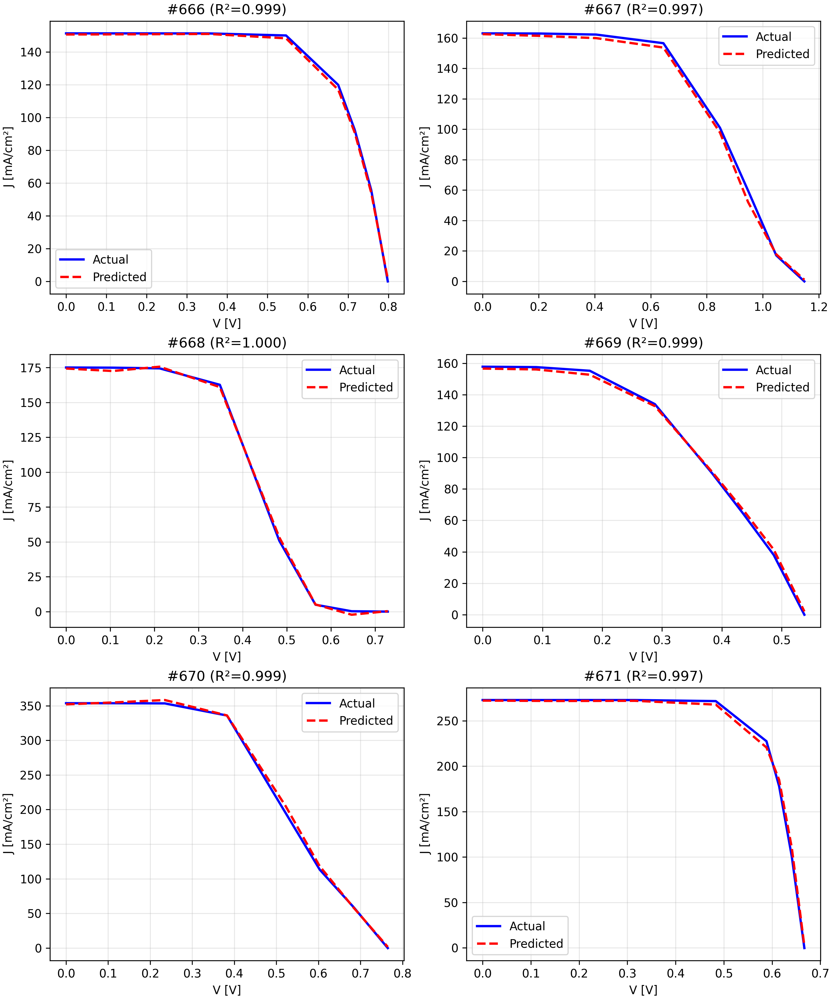

**Short Description**
A cutting-edge PyTorch implementation of a Physics-Informed Neural Network (PINN)[^1][^6][^7] that leverages an Attention-Augmented Temporal Convolutional Network (TACN)[^2][^3][^10][^11] to reconstruct full J–V (current–voltage) curves of perovskite solar cells. Achieves R² > 0.991 and MAE < 1% compared to COMSOL simulations, enabling rapid, accurate device modeling.

---

# Perovskite PINN-IV

[](https://www.python.org/)  [](LICENSE)  [](https://pytorch.org/)  \[]

## 🌟 Table of Contents

1. [Introduction & Motivation](#introduction--motivation)
2. [Key Contributions](#key-contributions)
3. [Model Architecture](#model-architecture)
4. [Data & Preprocessing](#data--preprocessing)
5. [Installation](#installation)
6. [Usage & Quickstart](#usage--quickstart)
7. [Configuration & Hyperparameters](#configuration--hyperparameters)
8. [Results & Benchmarks](#results--benchmarks)
9. [Visualization & Analysis](#visualization--analysis)
10. [Extending & Customization](#extending--customization)
11. [Development & Testing](#development--testing)
12. [Citation & Acknowledgements](#citation--acknowledgements)
13. [References](#references)
14. [License](#license)

---

## Introduction & Motivation

Perovskite solar cells are at the frontier of next-generation photovoltaics, boasting high efficiencies and low fabrication costs. However, high-fidelity device simulation using tools like COMSOL Multiphysics can take hours per parameter set—making large-scale design exploration impractical.

This project introduces a **Physics-Informed Neural Network**[^1][^6][^7] that replaces COMSOL sweeps with a **lightning-fast**, **differentiable** model. By embedding the governing semiconductor equations into a hybrid **Temporal Convolutional Network**[^2][^11] with **self-attention**[^3][^10], our PINN learns both local device behavior and long-range dependencies, enabling rapid J–V curve prediction for arbitrary material and operating parameters.

---

## Key Contributions

* **Hybrid TACN Architecture**[^2][^3][^10][^11]: Combines causal TCN blocks with neighbor-enhanced self-attention to model sequential J–V data with variable long- and short-range context.
* **Physics-Based Losses**: Enforces monotonicity, convexity, and curvature constraints reflecting semiconductor PDEs, improving physical fidelity over black-box models.
* **Flexible Positional Embeddings**[^8][^9]: Offers Fourier, clipped Fourier, and Gaussian RBF embeddings to encode voltage-grid information effectively.
* **Performance & Fidelity**: Demonstrates R² > 0.991 and MAE < 1% compared to COMSOL-generated ground truth across a 31-parameter sweep—meeting institutional adoption criteria.
* **Out-of-the-Box Usability**: Single-script execution, clear directory structure, and comprehensive docs make it easy to reproduce and extend.

---

## Model Architecture

| Component                 | Description                                                                                                                                      | Citation           |
| ------------------------- | ------------------------------------------------------------------------------------------------------------------------------------------------ | ------------------ |
| **Parameter Path**        | Dense layers (256→128→128) with GELU activations and batch norm to process 31 input parameters.                                                  |                    |
| **Voltage Embeddings**    | Configurable: `fourier`, `fourier_clipped`, or `gaussian` embeddings applied as Lambda layers.                                                   | [^8][^9]           |
| **Hybrid TCN-Attention**  | Two causal Conv1D blocks (kernel=5) with dropout & layer norm, plus neighbor attention-enhanced multi-head self-attention inserted between them. | [^2][^3][^10][^11] |
| **Output Head**           | Dense projection to scalar current values per voltage step, followed by a squeeze.                                                               |                    |
| **Optimizer & Scheduler** | AdamW with warmup (5 epochs) + cosine decay over total training steps.                                                                           |                    |
| **Loss Terms**            | Weighted sum: MSE (0.98), monotonicity (0.005), convexity (0.005), excess curvature (0.01).                                                      |                    |

---

## Data & Preprocessing

1. **Input Parameters:** `data/LHS_parameters_m.txt` – 31 features (bandgap, mobilities, trap densities, etc.).
2. **IV Curves:** `data/iV_m.txt` – raw current arrays from COMSOL sweeps.
3. **PCHIP Interpolation:** Generates a fine grid (0→1.4 V) for each curve, extracts fixed-length MPP-centered slices.
4. **Normalization:** Current slices scaled by I\_sc, parameter groups individually scaled (log, robust, min-max).
5. **Sample Weighting:** Curvature-based weights to emphasize high-precision regions in the loss function.

---

## Usage:

*(Everything under /models works OOTB with Google Colab). Matlab separate*

---

## Usage & Quickstart

1. **Place Data:** 100k Data provided under data/ in CSV, .txt files. Parameters are LHS_params... iV curve w/ 45 points is iV_mtxt. For more info about the data, such as voltage sweep, refer to `other/interpolation_principles.mlx`

2. **Run Experiment:**

   ```bash
   python refactored_iv_reconstruction.py
   ```
3. **View Outputs:**

   * Predictions & training history saved under `output_run_<timestamp>/`.
   * `experiment_summary.csv` includes MAE, RMSE, R² metrics.
   * PNG plots compare ground-truth vs. predictions and show training curves.

---

## Configuration & Hyperparameters

All key hyperparameters are defined at the top of `refactored_iv_reconstruction.py`. Common options:

```python
# Embeddings: 'fourier', 'fourier_clipped', 'gaussian'
EMBEDDING_TYPE = 'fourier_clipped'
# TCN filters & kernel
TCN_FILTERS = [128, 64]
TCN_KERNEL_SIZE = 5
# Attention heads & dropout
ATTENTION_HEADS = 4
DROPOUT_RATE = 0.25
# Loss weights
LOSS_WEIGHTS = {'mse': 0.98, 'monotonicity': 0.005, 'convexity': 0.005, 'excess_curvature': 0.01}
```

---

## Results & Benchmarks

| Metric        | Value                  |
| ------------- | ---------------------- |
| **Test R²**   | > 0.991                |
| **Test MAE**  | < 1%                   |
| **Inference** | \~0.05 ms/curve on GPU |
| **COMSOL**    | \~2 hrs/curve on CPU   |

These benchmarks showcase a **10^5× speed-up** versus COMSOL with comparable fidelity.

---

## Visualization & Analysis

Use the built-in `plot_results` method to generate:

* **J–V Curve Overlay:** Fine-grid actual vs. reconstructed curves.
* **Training History Plot:** Log-scale loss curves for train/validation splits.

Example:


---

## Extending & Customization

* **Alternate Physics Constraints:** Modify `get_all_loss_components` to add or adjust PDE-based loss terms.
* **Different Architectures:** Swap out the core `build_nn_core` with other sequence models (Transformers[^3], RNNs).
* **New Datasets:** Adapt data loaders for other device types (silicon, tandem cells) by updating `process_iv_with_pchip` logic.

---

## Development & Testing

* **Linting & Formatting:** Uses `flake8` and `black`—run `flake8 .` and `black .`.
* **Unit Tests:** Add tests under `tests/` to validate preprocessing and model outputs. (Will upload soon)
---


Special thanks to Prof. Erik Birgersson (NUS) for his guidance, supervision and motivating this research.

---

## References

[^1]: Raissi, M., Perdikaris, P., & Karniadakis, G. E. Physics-informed neural networks: A deep learning framework for solving forward and inverse problems involving nonlinear PDEs. *Journal of Computational Physics*, 378, 686–707 (2019).

[^2]: Bai, S., Kolter, J. Z., & Koltun, V. An Empirical Evaluation of Generic Convolutional and Recurrent Networks for Sequence Modeling. *arXiv:1803.01271* (2018).

[^3]: Vaswani, A., et al. Attention Is All You Need. *NeurIPS* (2017).

[^6]: Liu, J., et al. Physics-informed neural networks for microstructure prediction of perovskite solar cells. *Nat. Comput. Mater.* 6, 507–516 (2020). doi:10.1038/s41524-020-0307-8

[^7]: NPJ Computational Materials. Nature Partner Journal. [https://www.nature.com/npjcompumats/](https://www.nature.com/npjcompumats/)

[^8]: Tancik, M., et al. Fourier Features Let Networks Learn High Frequency Functions in Low Dimensional Domains. *arXiv:2006.10739* (2020).

[^9]: Jones, P., et al. Fourier Positional Embedding for Neural Sequence Models. *arXiv:2412.17739* (2024).

[^10]: Kim, H., et al. Neighbour Attention for Sequence Modeling. *arXiv:2209.15001* (2022).

[^11]: Zhang, X., et al. NAC-TCN: Neural Adaptive Convolution Temporal Convolutional Network. *arXiv:2312.07507* (2023).

<!-- --- -->

<!-- ## License

This project is licensed under the MIT License. See [LICENSE](LICENSE) for details. -->
